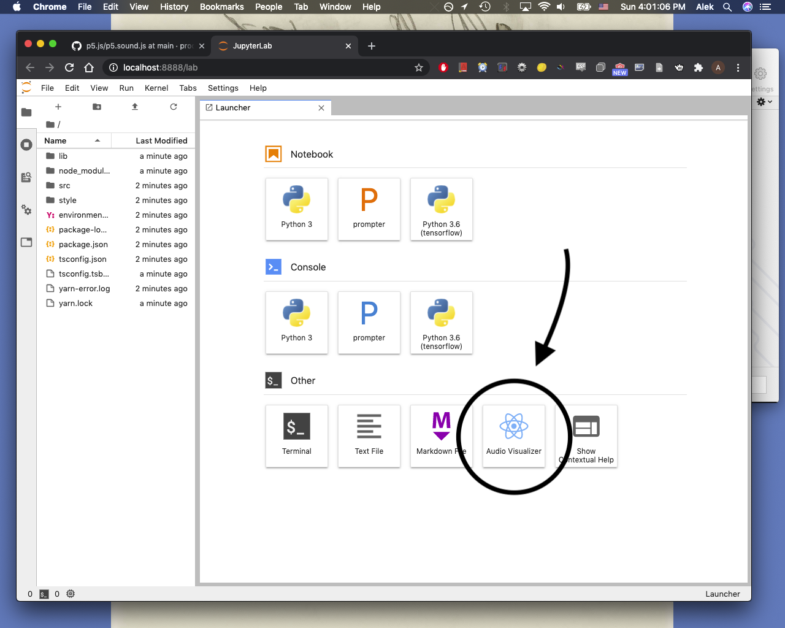
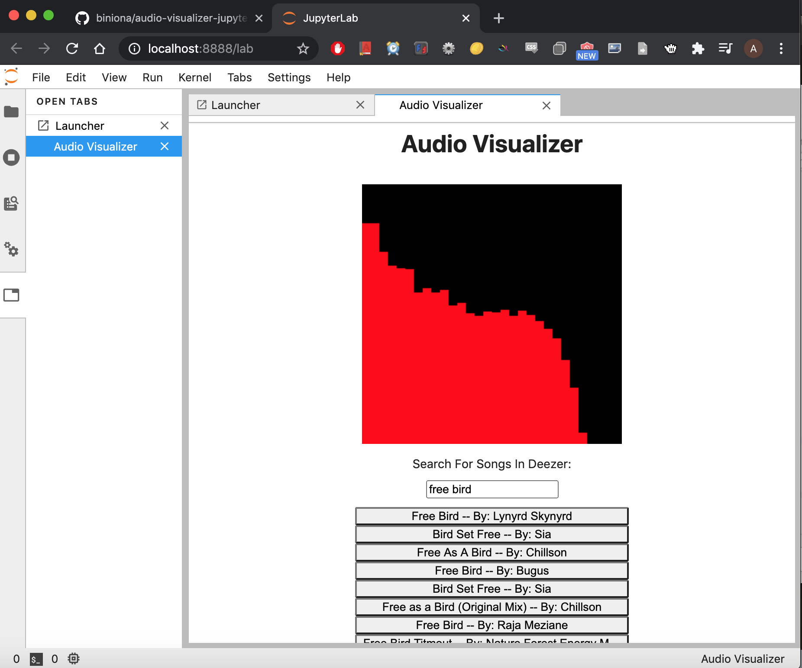

# Jupyter Lab Extension For Visualizing Song Frequency

## Background

This is a Jupyter Lab Extension for Visualizing song frequency information Powered by the Deezer API. This is based off the [react-widget extension example](https://github.com/jupyterlab/extension-examples/tree/master/react/react-widget) from the [Jupyter Lab Extensions Example](https://github.com/jupyterlab/extension-examples) repository.

I found [this blogpost](http://ianreah.com/2013/02/28/Real-time-analysis-of-streaming-audio-data-with-Web-Audio-API.html) as well as the [p5.js sound library source code](https://github.com/processing/p5.js/blob/main/lib/addons/p5.sound.js) extremely helpful in learning to work with the Web-Audio API in order to run an FFT analyzer on a remote mp3 file.

## Setup 

To build JupyterLab with the extension, run the following command:

	git clone https://github.com/biniona/audio-visualizer-jupyter-lab-extension.git && \
	  cd audio-visualizer-jupyter-lab-extension && \
	  conda env create && \
	  conda activate audio-visualizer-extension && \
	  jlpm && \
	  jlpm run build && \
	  jupyter labextension install . && \
	  jupyter lab 

The extension is in the \"Other\" section of the launcher: 

Type a query into the search bar and click a song button to play that song and see its frequency graph: 

